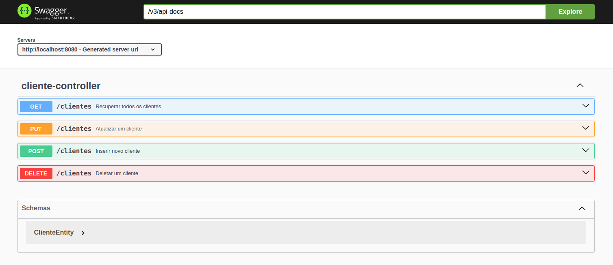
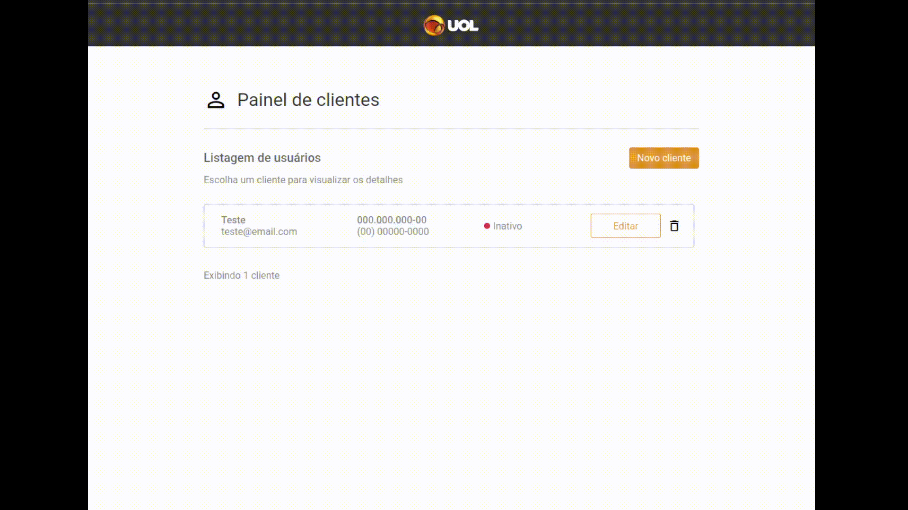
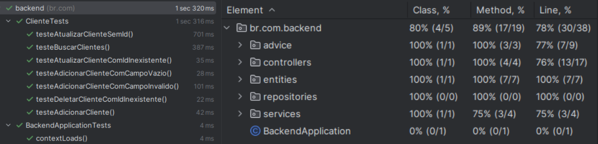
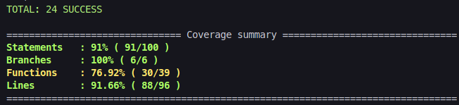

# Teste Fullstack UOL: Aplicativo de Gerenciamento de Clientes

Esta é uma aplicação para controle de clientes, na qual é possível recuperar, inserir, atualizar e deletar clientes.

É uma implementação Fullstack feita com Angular, Java e MySQL.


## Funcionalidades

- Listagem de clientes contendo todas suas informações (nome, email, cpf, telefone e status).
- Criação de um novo cliente através de um formulário.
- Edição de um cliente já registrado através de um formulário.
- Máscaras para CPF e telefone para garantir dados corretos e consistentes.
- Validação de dados, barrando dados inválidos e registro de email e CPF repetidos.
- Alertas para o usuário em caso de dados inválidos, caso de sucesso e caso de erro.
- Exclusão de clientes do registro, com pop-up para confirmação da ação.
- Persistência de todas as informações e suas modificações em um banco de dados.


## Tecnologias utilizadas
- Angular 15
- Java 17
- Spring Boot 3.2.3
- MySQL
- Docker
- Jasmine, JUnit


## Instalação e execução local

Para rodar esta aplicação é necessário ter o Docker e o Docker Compose instalados em sua máquina.

Certifique-se também de ter as portas 3306, 8080 e 4200 desocupadas


1. Clone o repositório e entre no diretório
```bash
  git clone git@github.com:lzaghi/test-fullstack-uol.git
  cd test-fullstack-uol
```

2. A partir da raiz do projeto, suba os containeres do banco de dados, back e front
```bash
  docker-compose up -d --build
```

A aplicação já estará rodando! :)</br>
Acesse ```http://localhost:4200``` para a experiência de usuário. O backend estará rodando em ```http://localhost:8080```.


Para parar a aplicação, basta executar o comando na raiz do projeto
```bash
  docker-compose down --remove-orphans
```


## Documentação

A documentação completa e interativa da API, com todas as operações possíveis, pode ser consultada localmente em ```http://localhost:8080/swagger-ui.html``` após a aplicação estar rodando.

<details open>
<summary style="font-weight: bold;">Swagger</summary>



</details>


Segue um resumo do que é documentado na rota citada acima:
<details open>
<summary><strong>Especificações das requisições</strong></summary>

<strong>Consultar clientes</strong>

```http
GET /clientes
```
<details><summary>Exemplo de retorno:</summary></br>

Status 200:
```json
[
  {
    "id": 1,
    "nome": "Exemplo da Silva",
    "email": "exemplo@email.com",
    "cpf": "12345678900",
    "telefone": "00123456789",
    "status": "Ativo"
  },
  {
    "id": 2,
    "nome": "Teste Oliveira",
    "email": "teste@email.com",
    "cpf": "97865432100",
    "telefone": "0087654321",
    "status": "Inativo"
  },
]
```
</details>

----

<strong>Cadastrar cliente</strong>

```http
POST /clientes
```
<details><summary>Exemplo de Entrada:</summary></br>

```json
{
    "nome": "Exemplo da Silva",
    "email": "exemplo@email.com",
    "cpf": "12345678900",
    "telefone": "00123456789",
    "status": "Ativo"
  }
```
Todos os campos são obrigatórios.
- email deve ter um formato válido e ser único
- cpf deve ter 11 dígitos e ser único
- telefone deve ter 10 ou 11 dígitos (ddd + número de 8 ou 9 dígitos)
- status deve ser "Ativo", "Inativo", "Desativado" ou "Aguardando ativação"

</details>

<details><summary>Exemplo de retorno:</summary></br>

Em caso de sucesso - status 201:
```json
{
    "id": 1,
    "nome": "Exemplo da Silva",
    "email": "exemplo@email.com",
    "cpf": "12345678900",
    "telefone": "00123456789",
    "status": "Ativo"
  }
```

Em caso de erro - status 400:
```json
{
  "erro no campo 'nome'": "campo 'nome' é obrigatório",
  "erro no campo 'email'": "formato de email inválido",
  "erro no campo 'status'": "valor de status inválido"
}
```
Ou então:
```json
{
  "Erro": "Email já cadastrado",
}
```
```json
{
  "Erro": "CPF já cadastrado",
}
```
</details>

----

<strong>Atualizar clientes</strong>

```http
PUT /clientes
```
<details><summary>Exemplo de Entrada:</summary></br>

```json
{
    "id": 1,
    "nome": "Exemplo da Silva",
    "email": "exemplo@email.com",
    "cpf": "99900099900",
    "telefone": "00123456789",
    "status": "Ativo"
  }
```
Todos os campos são obrigatórios.
- id deve ser existente no banco de dados
- email deve ter um formato válido e ser único
- cpf deve ter 11 dígitos e ser único
- telefone deve ter 10 ou 11 dígitos (ddd + número de 8 ou 9 dígitos)
- status deve ser "Ativo", "Inativo", "Desativado" ou "Aguardando ativação"

</details>

<details><summary>Exemplo de retorno:</summary></br>

Em caso de sucesso - status 200:
```json
{
    "id": 1,
    "nome": "Exemplo da Silva",
    "email": "exemplo@email.com",
    "cpf": "99900099900",
    "telefone": "00123456789",
    "status": "Ativo"
  }
```

Em caso de erro - status 404:

```json
{
  "Cliente não encontrado"
}
```

Status 400:
```json
{
  "campo 'id' é obrigatório"
}
```
```json
{
  "erro no campo 'nome'": "campo 'nome' é obrigatório",
  "erro no campo 'email'": "formato de email inválido",
  "erro no campo 'status'": "valor de status inválido"
}
```
Ou então:
```json
{
  "Erro": "Email já cadastrado",
}
```
```json
{
  "Erro": "CPF já cadastrado",
}
```
</details>

----

<strong>Deletar clientes</strong>

```http
DELETE /clientes?id={id}
```
<details><summary>Exemplo de retorno:</summary></br>

Em caso de sucesso - status 204:
```http
no content
```
Em caso de erro - status 404:
```json
{
  "Cliente não encontrado"
}
```
</details>
</details>

## Demonstração

<details open>
<summary style="font-weight: bold;">Exemplo de uso</summary>



</details>

## Testes

### Backend

Para rodar os testes do backend, execute o comando no diretório /backend:
```bash
  mvn test
```
(necessário ter Java/Maven instalado)

<details open>
<summary style="font-weight: bold;">Cobertura</summary>



</details>


### Frontend

Para rodar os testes do frontend, execute o comando no diretório /frontend:
```bash
  npm test
```
(necessário ter Angular CLI instalado)

<details open>
<summary style="font-weight: bold;">Cobertura</summary>


</details>


